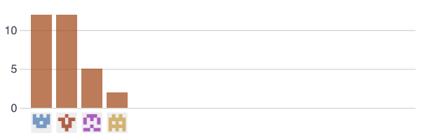

# Capítulo V: Implementación, Validación y Despliegue del Producto

## 5.1. Software Configuration Management
En esta sección se abordarán los diferentes aspectos relacionados con la configuración de las herramientas necesarias para el desarrollo del proyecto, desde la creación de la Landing Page hasta el producto final que incluye el backend. También se explicarán las herramientas empleadas para el diseño UX/UI, convenciones de estilo, configuración de despliegue y más.

### 5.1.1. Software Development Environment Configuration
En esta parte se detallan las aplicaciones y productos de software que se utilizarán a lo largo del desarrollo del proyecto. Estas herramientas se organizan en las siguientes categorías:

#### Project Management

- Requirements Management

- Product UX/UI Design

- Software Development

- Software Testing

- Software Documentation


#### Project Management
La gestión de proyectos tiene como objetivo la administración eficiente de los recursos y procesos para lograr los resultados esperados. Durante el desarrollo, se implementará un producto de software basado en el modelo SaaS accesible desde navegadores web; no se desarrollará una versión móvil del mismo.

Para mantener la organización y comunicación del equipo, se utilizó:

- Discord: Plataforma social ideal para la creación de grupos y comunidades, usada aquí para realizar reuniones virtuales y llamadas grupales de coordinación.

#### Requirements Management
Este proceso asegura que las necesidades y expectativas de los clientes y partes interesadas sean documentadas, verificadas y satisfechas adecuadamente.

- Pivotal Tracker: Herramienta de gestión de historias de usuario que facilita la organización de tareas en epopeyas y su priorización mediante un sistema de puntuaciones. Permite visualizar en tiempo real el avance del proyecto y realizar ajustes de manera colaborativa.

#### Product UX/UI Design
El diseño UX/UI es fundamental para crear productos que se adapten a las necesidades de los usuarios. En este proyecto, se busca construir un sitio web compatible con computadoras y dispositivos móviles. Para ello, se emplearon varias herramientas:

- Figma: Aplicación en línea para la creación de wireframes y mockups, facilitando la transición de diseño a código.

- UXPressia: Plataforma especializada en la creación de User Personas, Empathy Maps, Journey Maps, y otros artefactos de experiencia de usuario.

- Miro: Pizarra digital colaborativa ideal para realizar lluvias de ideas, mapas mentales, wireframes, y actividades de ideación conjunta.

- LucidChart: Herramienta online de diagramación en tiempo real que permite crear diagramas UML, modelos C4, mapas mentales, entre otros.

- Overflow: Herramienta de diagramación de Userflows que facilita la colaboración en tiempo real, complementando el diseño de experiencias de usuario.

#### Software Development
En cuanto al desarrollo de la aplicación, se emplearon las siguientes herramientas:

- Visual Studio Code: Editor de código fuente intuitivo, compatible con múltiples lenguajes de programación y extensible mediante plugins.

- Rider: IDE de JetBrains especializado en el desarrollo de aplicaciones .NET y ASP.NET, donde C# será el lenguaje principal. Se utilizará para construir el Web Service del proyecto.

- GitHub: Plataforma de hospedaje de repositorios Git, clave para la colaboración del equipo y el control de versiones del código y la documentación en formato Markdown.

#### Software Testing
Esta disciplina se centra en la validación y verificación del correcto funcionamiento del software desarrollado.

- Lenguaje Gherkin: Lenguaje específico de dominio (DSL) utilizado para describir historias de usuario y escenarios de prueba, estructurando los casos de prueba bajo patrones como Característica, Escenario, Dado, Cuando, Entonces.

#### Software Documentation
La documentación de software incluye todos los textos e ilustraciones que explican el uso, funcionalidad y operación del producto. Esta documentación puede estar integrada en el código fuente o presentarse como manuales independientes.


### 5.1.2. Source Code Management

En esta sección se explica qué métodos se emplearon para registrar los cambios realizados, además de definir la semántica y las convenciones de nombres que se aplicarán a los commits y las versiones a lo largo del desarrollo del proyecto.

Primero, es importante señalar que utilizaremos GitHub como plataforma principal para el control de versiones del informe, la landing page, el servicio web y el frontend del proyecto. Para ello, se han creado los repositorios correspondientes.

- Url del repositorio: https://github.com/4346-BlockOps-App-Open-Source/Capitalent-Project-Report.git
- Repositorio Landing page: https://github.com/4346-BlockOps-App-Open-Source/Landing-Page-Capitalent.git

#### GitFlow
GitFlow es una metodología de trabajo que organiza el desarrollo a través de ramas principales y ramas auxiliares. Optamos por emplear este modelo porque facilita mantener el código limpio y estructurado, permitiéndonos trabajar en equipo de forma más eficiente. Su fortaleza radica en la variedad de tipos de ramas que ofrece, cada una con un propósito específico:

#### Ramas Principales:

- Main: Es la rama base del proyecto, de la cual se derivan todas las demás. Contiene el código estable y listo para ser puesto en producción. Cada actualización en esta rama representa una nueva versión del proyecto.

- Develop: Se deriva de la rama Main y sirve como la rama de integración donde se combinan las nuevas funcionalidades desarrolladas. El código que esté listo en esta rama se transferirá posteriormente a Main para generar una nueva versión (release) del proyecto.

#### Ramas de Apoyo:

- Feature: Son ramas que nacen a partir de Develop, creadas para trabajar en funciones específicas del proyecto. Se generan tantas ramas Feature como funcionalidades existan. Al completar su desarrollo, deben integrarse nuevamente en Develop y ser eliminadas. La nomenclatura que se utiliza para nombrarlas sigue un formato específico:

```
feature/benefits
feature/profile
feature/memberships
```
- Release: Son ramas que se crean a partir de Develop y se utilizan para preparar una nueva versión del proyecto lista para ser publicada. Es importante mencionar que, si es necesario añadir nuevas funcionalidades, deberá crearse una nueva rama Release, siguiendo las reglas de Semantic Versioning 2.0.0, que se detallarán más adelante.

- Hotfix: Estas ramas se originan desde Main y se emplean para solucionar de manera rápida errores detectados en el código que ya está en producción (Main). Una vez corregido el problema, la rama Hotfix debe integrarse tanto en Main como en Develop.

#### Semantic Versioning

Es un conjunto de reglas que nos ayudan a administrar adecuadamente la numeración de versiones de nuestro proyecto. Lo aplicaremos en las ramas **Release**, utilizando el formato **X.Y.Z** (Mayor, Menor, Parche):

- **Versión de Parche (Z):** Se incrementa cuando se corrigen errores que no afectan la compatibilidad con versiones anteriores.
- **Versión Menor (Y):** Se incrementa al agregar nuevas funcionalidades que mantienen la compatibilidad con versiones previas.
- **Versión Mayor (X):** Se incrementa si se introducen cambios que rompen la compatibilidad con versiones anteriores. Cuando esto sucede, los valores de Y y Z se reinician a 0.

**Ejemplos de ramas Release:**
```
release-1.0.5
release-2.1.3
release-2.2.1
```

#### Conventional Commits

Se trata de un conjunto de normas para estructurar nuestros mensajes de commit, facilitando un historial de cambios claro y fácil de entender para todo el equipo. La estructura básica es:

```
<type> [scope opcional]: <descripción>
[cuerpo opcional]
[footer opcional]
```

- **type:** Define el tipo de cambio realizado:
  - `feat:` para nuevas funcionalidades.
  - `docs:` para cambios en la documentación.
  - `fix:` para correcciones de errores.
  - `chore:` para tareas menores que no afectan el código fuente.
  - `refactor:` para reestructuración interna sin alterar el comportamiento del proyecto.
  - `build:` para cambios en el sistema de construcción o en dependencias externas.
  - `perf:` para mejoras en el rendimiento.

- **scope (opcional):** Especifica el área o módulo afectado por el cambio.
- **description (obligatorio):** Breve explicación en minúsculas y en modo imperativo sobre lo que se modificó.
- **body (opcional):** Detalla información adicional sobre el cambio.
- **footer (opcional):** Se utiliza para indicar información relevante sobre cambios importantes o advertencias.


### 5.1.3. Source Code Style Guide & Conventions


#### Nomenclatura General

En nuestro proyecto, los nombres de variables, objetos, elementos y funciones estarán en **minúsculas**. Esto sigue la recomendación de W3Schools, que señala que mezclar mayúsculas y minúsculas puede dificultar la legibilidad.

**Ejemplos:**
```css
.gallery {}
.video {}
.login {}
```


#### Sangría

En archivos HTML, CSS y JavaScript utilizaremos **2 espacios** para la sangría en bloques de código. El uso de la tecla "Tabulación" está desaconsejado.

**Ejemplos:**

HTML:
```html
<!DOCTYPE html>
<html>
  <head>
    <title>Título</title>
  </head>
  <body>
    <h1>Encabezado</h1>
    <p>Párrafo.</p>
  </body>
</html>
```

CSS:
```css
html {
  background: #fff; /* Fondo blanco */
  color: #404;       /* Color gris */
}
```

JavaScript:
```javascript
function toCelsius(fahrenheit) {
  return (5 / 9) * (fahrenheit - 32);
}
```


#### HTML: 

- **Declaración del Doctype:** Siempre inicia el documento con `<!DOCTYPE html>`.
- **Líneas en blanco:** Agrega líneas en blanco entre secciones grandes para mejorar la legibilidad.

**Ejemplo:**
```html
<body>

<h1>Famous Cities</h1>

<h2>Tokyo</h2>
<p>Tokyo is the capital of Japan...</p>

<h2>London</h2>
<p>London is the capital city of England...</p>

</body>
```

- **Atributos entre comillas dobles:** Aunque no es obligatorio, mejora la legibilidad.
```html
<table class="striped">
```

- **No omitir `<title>`:** Siempre agrega un `<title>` en la cabecera del documento para mejorar el SEO y la accesibilidad.
```html
<title>HTML Style Guide and Coding Conventions</title>
```

- **Saltos de línea en HTML:** Evita líneas de código excesivamente largas, indenta con 4 espacios en subelementos.
```html
<button mat-icon-button color="primary" class="menu-button"
(click)="openMenu()">
  <mat-icon>menu</mat-icon>
</button>
```


#### CSS: 

- **Uso de Shorthand:** Escribe propiedades combinadas en una sola línea para mayor eficiencia.
```css
padding: 0 1em 2em;
border-top: 0;
font: 100%/1.6 palatino, georgia, serif;
```

- **Formato de declaración:** Deja un espacio entre el selector y la llave, y entre la propiedad y su valor.
```css
html {
  background: #fff;
  color: #404;
}
```

- **Uso de comillas:** Utilizar **comillas simples** en CSS.
```css
html {
  font-family: 'open sans', arial, sans-serif;
}
```


#### JavaScript: 

- **Espacios alrededor de operadores y comas:**
```javascript
let x = y + z;
const myArray = ['Volvo', 'Saab', 'Fiat'];
```

- **Finalizar con punto y coma las declaraciones:**
```javascript
const cars = ['Volvo', 'Saab', 'Fiat'];
```

- **Llaves en funciones:** La apertura de llaves va al final de la línea de definición de la función.
```javascript
function toCelsius(fahrenheit) {
  return (5 / 9) * (fahrenheit - 32);
}
```

- **Objetos:** Abrir y cerrar con llaves correctamente y usar comillas dobles en strings.
```javascript
const person = {
  firstName: "John",
  lastName: "Doe",
  age: 50,
  eyeColor: "blue"
};
```


#### Gherkin: Buenas prácticas

Gherkin es el lenguaje que usaremos para definir nuestros escenarios de prueba de forma clara y estructurada.

- **Bloques Given-When-Then indentados:** Indenta correctamente los pasos del escenario. Usa indentación adicional para `And`.
```gherkin
Scenario: Administrador accede al catálogo de menús diarios
  Given que el administrador está autenticado
  When el administrador navega a "Catálogo de Menús"
    Then el sistema muestra una lista de menús diarios
      And permite filtrar y buscar menús
```

- **Uso de tablas:** Para datos estructurados dentro de un escenario.
```gherkin
Then se mostrará el mensaje:
  | Mensaje |
  | Se completaron los requisitos adecuadamente |
```

- **Reducir ruido:** Usar valores estándar entre comillas simples para simplificar escenarios.
```gherkin
When escribo claramente los requisitos 'dominio en C'
```

- **Separadores entre escenarios:** Agrega un salto de línea y un comentario.
```gherkin
Scenario: Administrador recibe notificación
Given que el administrador está autenticado
When el pedido cambia de estado
  Then el sistema envía una notificación
    And muestra detalles relevantes

# --------------------------

Scenario: Otro escenario
Given otro contexto
When otra acción ocurre
  Then otro resultado se muestra
```

### 5.1.4. Software Deployment Configuration
Esta sección detalla la configuración y los procesos requeridos para desplegar el software en entornos de producción o pruebas.

*Landing Page*
Para el despliegue de la landing page se utilizara github 

Paso 1: Para desplegar el LandingPage hay que dirigirse al repositorio del landingPage y luego entrar a la opción de settings


Paso 2: Ahora entraremos a la opción de Pages donde seleccionaremos la rama del proyecto que queremos desplegar


Paso 3: Luego se podra visualizar el enlace de la landing page desplegada


## 5.2. Landing Page, Services & Applications Implementation

### 5.2.1. Sprint 1
Esta sección ofrece una visión general del primer sprint, incluyendo planificación, ejecución y actividades de revisión.

#### 5.2.1.1. Sprint Planning 1

<table>
  <tbody>
    <tr>
      <td><strong>Sprint #</strong></td>
      <td>Sprint 1</td>
    </tr>
    <tr>
      <td colspan="2"><strong>Sprint Planning Background</strong></td>
    </tr>
    <tr>
      <td><strong>Date</strong></td>
      <td>2025-04-12</td>
    </tr>
    <tr>
      <td><strong>Time</strong></td>
      <td>7:50 PM</td>
    </tr>
    <tr>
      <td><strong>Location</strong></td>
      <td>Remote via the GitHub platform</td>
    </tr>
    <tr>
      <td colspan="2"><strong>Prepared by</strong></td>
    </tr>
    <tr>
      <td><strong>Attendees (for the planning meeting)</strong></td>
      <td>All members of the Capitalent team</td>
    </tr>
    <tr>
      <td><strong>Sprint 0 Review Summary</strong></td>
      <td>As this is the first development sprint, no sprint review has been completed yet.</td>
    </tr>
    <tr>
      <td><strong>Sprint 0 Retrospective Summary</strong></td>
      <td>As this is the first development sprint, no sprint retrospective has been completed yet.</td>
    </tr>
    <tr>
      <td colspan="2"><strong>Sprint Goal & User Stories</strong></td>
    </tr>
    <tr>
      <td><strong>Sprint 1 Goal</strong></td>
      <td>Our main focus for this sprint is to build the landing page for Capitalent. This page is crucial for engaging potential users, showcasing the platform's value, and increasing sign-ups. We aim to track user interaction with the page to measure the success of this initiative.</td>
    </tr>
    <tr>
      <td><strong>Sprint 1 Velocity</strong></td>
      <td>12</td>
    </tr>
    <tr>
      <td><strong>Sum of Story Points</strong></td>
      <td>26</td>
    </tr>
  </tbody>
</table>


#### 5.2.1.2. Aspect Leaders and Collaborators
<table>
  <tbody>
    <tr>
      <td><strong>Team Member (Last Name, First Name)</strong></td>
      <td><strong>GitHub Username</strong></td>
      <td><strong>Landing Page</strong></td>
    </tr>
    <tr>
      <td>Elescano Leon, Piero Hugo</td>
      <td>PieroHugo</td>
      <td>L</td>
    </tr>
    <tr>
      <td>Gutarra Velapatiño, Sebastian</td>
      <td>SebastianGutarra</td>
      <td>C</td>
    </tr>
    <tr>
      <td>Llerena Delgado, Renzo Miguel</td>
      <td>Renxoll</td>
      <td>C</td>
    </tr>
    <tr>
      <td>Mechan Chumpitaz, Rodrigo Nicolás</td>
      <td>Rodrigo270304</td>
      <td>C</td>
    </tr>
    <tr>
      <td>Villafuerte Tapia, Renzo Alonso</td>
      <td>RenzoVi21</td>
      <td>C</td>
    </tr>
  </tbody>
</table>


#### 5.2.1.3. Sprint Backlog 1

<table>
  <tbody>
    <tr>
      <td><strong>Sprint #</strong></td>
      <td>Sprint 1</td>
    </tr>
    <tr>
      <td><strong>User Story</strong></td>
      <td><strong>Work-item / Task</strong></td>
    </tr>
    <tr>
      <td><strong>Id</strong></td>
      <td>Title</td>
      <td><strong>Id</strong></td>
      <td><strong>Title</strong></td>
      <td><strong>Description</strong></td>
      <td><strong>Estimation (Hours)</strong></td>
      <td><strong>Assigned To</strong></td>
      <td><strong>Status</strong></td>
    </tr>
    <!-- Main Section -->
    <tr>
      <td>US-01</td>
      <td>Visualización clara del valor de la plataforma</td>
      <td>US-01</td>
      <td>Mostrar los beneficios clave de Capitalent en la página de inicio</td>
      <td>Como usuario nuevo, quiero ver los beneficios clave de Capitalent en la página de inicio para motivarme a registrarme.</td>
      <td>3</td>
      <td>Renzo Llerena</td>
      <td>Done</td>
    </tr>
    <!-- Call-to-Action Section -->
    <tr>
      <td>US-02</td>
      <td>Llamado a la acción visible</td>
      <td>US-02</td>
      <td>Resaltar un botón de registro destacado</td>
      <td>Como usuario, quiero ver un botón de registro destacado en la página principal para empezar rápidamente.</td>
      <td>2</td>
      <td>Renzo Llerena</td>
      <td>Done</td>
    </tr>
    <!-- Responsive Design -->
    <tr>
      <td>US-21</td>
      <td>Visualización en dispositivos móviles</td>
      <td>US-21</td>
      <td>Diseño responsivo para usuarios móviles</td>
      <td>Como usuario móvil, quiero que la interfaz esté adaptada a teléfonos para consultar señales fácilmente.</td>
      <td>2</td>
      <td>Rodrigo Mechan</td>
      <td>Done</td>
    </tr>
    <!-- About Section -->
    <tr>
      <td>US-46</td>
      <td>Diseño atractivo y moderno</td>
      <td>US-46</td>
      <td>Crear un diseño visualmente atractivo y moderno</td>
      <td>Como usuario, quiero que la landing page tenga un diseño atractivo y moderno para dar una buena impresión y facilitar la navegación.</td>
      <td>5</td>
      <td>Piero Elescano</td>
      <td>Done</td>
    </tr>
    <!-- Contact Section -->
    <tr>
      <td>US-47</td>
      <td>Información clara sobre características y beneficios</td>
      <td>US-47</td>
      <td>Mostrar las características y beneficios principales de Capitalent</td>
      <td>Como usuario, quiero ver de forma clara y concisa las principales características y beneficios de Capitalent en la página de inicio para poder tomar una decisión informada.</td>
      <td>4</td>
      <td>Renzo Villafuerte</td>
      <td>Done</td>
    </tr>
    <!-- Footer Section -->   
    <tr>
      <td>US-48</td>
      <td>Optimización para dispositivos móviles</td>
      <td>US-49</td>
      <td>Hacer la landing page completamente responsive para dispositivos móviles</td>
      <td>Como usuario de móvil, quiero que la landing page se vea bien y sea fácil de navegar desde mi teléfono para poder acceder a la información desde cualquier lugar.</td>
      <td>3</td>
      <td>Piero Elescano</td>
      <td>Done</td>
    </tr>
    <tr>
      <td>US-49</td>
      <td>Información sobre precios y suscripción</td>
      <td>US-50</td>
      <td>Mostrar claramente la estructura de precios de la plataforma</td>
      <td>Como usuario, quiero ver claramente la estructura de precios de la plataforma en la landing page para entender las opciones de suscripción disponibles.</td>
      <td>4</td>
      <td>Sebastian Gutarra</td>
      <td>Done</td>
    </tr>
    <tr>
      <td>US-50</td>
      <td>Sección de contacto con soporte</td>
      <td>US-51</td>
      <td>Incluir una sección de contacto para soporte</td>
      <td>Como usuario, quiero tener acceso fácil a una sección de contacto para poder obtener ayuda si tengo preguntas o problemas al visitar la landing page.</td>
      <td>3</td>
      <td>Rodrigo Mechan</td>
      <td>Done</td>
    </tr>
  </tbody>
</table>

#### 5.2.1.4. Development Evidence for Sprint Review
Esta subsección muestra la evidencia del trabajo de desarrollo completado durante el Sprint 1 para fines de revisión.
| Repository                  | Branch               | Commit Id | Commit Message                      | Committed on | Team Member                |
|------------------------------|----------------------|-----------|-------------------------------------|--------------|-----------------------------|
| Capitalent/landing-page      | main                 | d0fc541   | first commit                     | 25/04/2025   | Piero Elescano              |
| Capitalent/landing-page      | feature/home         | 1a794a4   | implementación de sección Home    | 26/04/2025      | Piero Elescano              |
| Capitalent/landing-page      | feature/about        | a55c8a5 | implementación de sección About   | 26/04/2025     | Renzo Llerena               |
| Capitalent/landing-page      | feature/how-it-works | ee99afa | implementación de sección How It Works | 27/04/2025  | Renzo Villafuerte           |
| Capitalent/landing-page      | feature/pricing      | 4ebddc0 | implementación de sección Pricing | 27/04/2025      | Sebastián Gutarra           |
| Capitalent/landing-page      | feature/contact      | ac6e7eb | implementación de sección Contact | 27/04/2025      | Rodrigo Mechan              |


#### 5.2.1.5. Execution Evidence for Sprint Review
Esta subsección resalta la evidencia de ejecución, incluyendo tareas completadas y hitos alcanzados durante el Sprint 1.
El equipo de desarrollo ha finalizado con éxito el sprint 1, que consistió en la implementación y el despliegue de la landing page de Capitalent. A continuación, se presentarán las evidencias correspondientes.


#### 5.2.1.6. Services Documentation Evidence for Sprint Review
No se dispone de pruebas de documentación, ya que el enfoque principal del primer sprint estuvo centrado en la creación de la landing page.

#### 5.2.1.7. Software Deployment Evidence for Sprint Review
Esta subsección incluye evidencia del despliegue exitoso del software durante el Sprint 1.
Para el despliegue de la Landing Page, el equipo utilizó GitHub Pages. Se trabajaron en un repositorio de GitHub y organizaron el trabajo en diversas ramas. En la sección de configuración y Pages, para luego poder hacer el despliegue de la web.


Link de la landing page: https://4346-blockops-app-open-source.github.io/Landing-Page-Capitalent/ 


#### 5.2.1.8. Team Collaboration Insights during Sprint
En esta sección se muestra cómo el equipo ha trabajado de manera colaborativa para completar la entrega del sprint. Se incluyen las métricas relacionadas con la creación de la landing page, utilizando HTML, CSS y JavaScript, así como los commits correspondientes.


### 5.2.2 Sprint 2 

#### 5.2.2.1. Sprint Planning 2

A continuación, se detalla, en la tabla siguiente, información sobre el planeameanto del segundo sprint. Además, para este sprint se definieron dos objetivos para cubrir los aspectos de sitio web estático y aplicación front-end. El primer objetivo se centra en desarrollar una mejora visual para el sitio web estático y añadir secciones para los usuarios del sitio web. Por otro lado, el segundo objetivo se centra en el desarrollo y despliegue de la primera versión de la aplicación front-end de Capitalent.

| Sprint #               | Sprint 2                                                                                      |
|------------------------|-----------------------------------------------------------------------------------------------|
| Sprint Planning Background | --                                                                                            |
| Date                   | 2025/05/01                                                                                  |
| Time                   | 11:15 PM                                                                                       |
| Location               | Reunión virtual en google meet                                 |
| Prepared By            | Llerena Delgado, Renzo Miguel                                                            
| Attendees              | Llerena Delgado, Renzo Miguel / Villafuerte Tapia, Renzo Alonso / Mechan Chumpitaz, Rodrigo Nicolás / Sebastian Ernesto Gutarra Velapatiño |
| Sprint 1 Review Summary | In the previous sprint, the team completed a first view of the Landing Page implementing the basic sections and styles it will need like Benefits, Plans, Information about the Startup. |
| Sprint 1 Retrospective Summary | The principal area the team has to improve is having more communication between the members to let each others know how the progress is going for each member. Now, the plan for next sprint is to work more organized so each member knows what to do. |
| Sprint Goal & User Stories | --                                                                                          |
| Sprint 2 Goals         | - Offer a more detailed visualization and greater adaptability of the StockSip Landing Page.<br>- Implement and deploy the first functional version of the Front-End with key features (warehouses, dashboard, product registration, warnings, care guides, navigation).<br>- Confirm goals by user access and interaction with the features across devices and languages. |
| Sprint 2 Velocity      | 100                                                                                           |
| Sum of Story Points    | 99                                                                                            |

### 5.2.2.2. Aspect Leaders and Collaborators ###

En esta sección, se incluye la matriz de liderazgo y colaboración desarrollada para este segundo sprint. Los principales aspectos que se toman en cuenta en este sprint se centran en cada las principales secciones que presenta el Front-End Web Application. Para esto, hemos definido las siguientes secciones: Inventarios y Zonas, Productos, Cuenta de Usuario, Reportes (Guía de cuidados y Reprote de pérdidas) y Alertas.

| Team Member                        | GitHub Username | Configuración y Notificaciones | DashBoard y señales | Registro-Onboarding | Educación Financiera 
|------------------------------------|-----------------|---------------------|-----------|-------------------|---------------------------------------------------
| Llerena Delgado, Renzo Miguel      | Renxoll      |                     |           | L                 |                                                   |
| Villafuerte Tapia, Renzo Alonso    | RenzoVi21   |                     |           |                   | L                                                   | 
| Mechan Chumpitaz, Rodrigo Nicolás | Rodrigo270304       | L                   |           |                   |                                                   |    
| Sebastian Ernesto Gutarra Velapatiño | SebastianGutarra  |                   | L         |                   |                                                   |      


### 5.2.2.3. Sprint Backlog 2 ###

Como se mencionó previamente en el planeamiento del sprint número 2, el objetivo del mismo es (OBJETIVO).

Luego de definir el objetivo del sprint, se identificaron las historias de usuario útiles para este sprint. A continuación, se dividió cada historia de usuario en tareas relacionadas a la implementación y cumplimiento de dicha historia. Para ello, se utilizó la aplicación _Trello_ que nos ayuda a gestionar el progreso del sprint. 
[Link de acceso al Sprint Backlog #2 en Trello](https://trello.com/b/g7YDMzPp/capitalent-sprint-backlog](https://trello.com/invite/b/681e8523bc9042c29ee05c9c/ATTI82f76ca66f0250bc4674e30272543efbCEA8A6CD/capitalent-sprint-backlog)

<p align="center">
  

  <p align="center">
  
A continuación, se presenta la tabla con las tareas necesarias para completar satisfactoriamente este tercer sprint. Además, se asignó un miembro del equipo a cada tarea a desarrollar y el estado de cada tarea.


| User Stories |               | Work Item/Task |             |                   |             |          |
|--------------|---------------|----------------|-------------|-------------------|-------------|----------|
| Id           | Title         | Id             | Description | Estimation (Hours)| Assigned to | Status   |
| US-007       | Registro inicial de usuario     | 1  | Como usuario nuevo quiero registrarme fácilmente para comenzar a usar la plataforma | 3 | Renzo Llerena | Done |
| US-008       | Selección de perfil de riesgo   | 2  | Como usuario quiero definir mi perfil de riesgo al registrarme para recibir señales adecuadas | 3 | Renzo Llerena | Done |
| US-005       | Personalización de señales      | 3  | Como usuario quiero personalizar qué tipo de señales recibo para que se ajusten a mis intereses | 3 | Renzo Llerena | Done |
| US-006       | Dashboard con resumen diario    | 4  | Como usuario quiero ver un resumen diario de los movimientos clave del mercado al abrir la plataforma | 3 | Rodrigo Mechan | To Review |
| US-003       | Recepción de señales de compra y venta | 5  | Como usuario quiero recibir notificaciones cuando se detecten oportunidades para comprar o vender | 5 | Rodrigo Mechan | To Review |
| US-004       | Explicación visual de las señales | 6  | Como usuario quiero ver por qué se generó una señal para entender mejor la recomendación | 5 | Rodrigo Mechan | To Review |
| US-032       | Quiz al final de cada lección   | 7  | Como usuario quiero hacer un pequeño test tras cada lección para evaluar lo aprendido | 3 |Renzo Villafuerte Tapia | Done |
| US-031       | Microlecciones de análisis técnico | 8  | Como usuario quiero acceder a lecciones cortas sobre análisis técnico para entender las señales | 3 | Renzo Villafuerte Tapia | Done |
| US-014       | Biblioteca de recursos financieros | 9  | Como usuario quiero tener acceso a una biblioteca de contenido educativo para profundizar en temas clave | 5 | Renzo Villafuerte Tapia | Done |
| US-013       | Acceso a contenido educativo desde el dashboard | 10 | Como usuario quiero ver consejos o guías rápidas al entrar a la plataforma para aprender de forma continua | 5 | Renzo Villafuerte Tapia | Done |
| US-030       | Centro de notificaciones dentro del dashboard | 11 | Como usuario quiero ver todas mis notificaciones en un solo lugar dentro de la app | 5 | Sebastián Gutarra | To Review |
| US-027       | Configuración de notificaciones | 12 | Como usuario quiero elegir qué tipo de notificaciones recibir para no saturarme | 3 | Sebastián Gutarra | To Review |
| US-022       | Interfaz adaptativa             | 13 | Como usuario quiero que la interfaz se adapte a mi pantalla para facilitar la navegación | 1 | Sebastián Gutarra | To Review |
| US-023       | Modo oscuro para visualización  | 14 | Como usuario quiero activar un modo oscuro para reducir la fatiga visual | 3 | Sebastián Gutarra | To Review |

### 5.2.2.4. Development Evidence for Sprint Review ###

En esta sección, se describen los principales avances de implementación realizados en este segundo sprint.

A continuación, se muestra una tabla que contiene la información sobre los _commits_ hechos que contienen partes de las funcionalidades que debemos implementar para completar el segundo sprint.

| Repository                             | Branch                           | Commit Id | Commit Message                                                   | Commited On |
|----------------------------------------|----------------------------------|-----------|------------------------------------------------------------------|-------------|
| BlockOps/Capitalent-Front-End-App       |     main                             |       23c2d4fea1823bea66b66a0661c82c4a96e48f93    |       Add files via upload                      |      14/05/2025        |
| BlockOps/Capitalent-Front-End-App       |     develop                          |   214febadefd45089a796e1255dcd705352d1473f        |         Add files via upload                           |    14/05/2025 |
| BlockOps/Capitalent-Front-End-App       |       feature/Configuración-notificaciones         |  675d3c40331dd0a6f709b048329e50fa8b2d0df6       |       Add files via upload           |    14/05/2025          |
| BlockOps/Capitalent-Front-End-App          |   feature/Dashboard-señales                     |     23c2d4fea1823bea66b66a0661c82c4a96e48f93        |       Add files via upload           |    14/05/2025          |
| BlockOps/Capitalent-Front-End-App         |    feature/Educación Financiera                  | 7dedbdec76aad06191a9285ac6a7fe971c258b5c          |      Add DEPENDENCIES.md to version control         |    14/05/2025         |
| BlockOps/Capitalent-Front-End-App         |   feature/Registro-Onboarding         |  7e3b3820dc7e3a3277f8f7c63058c55e45d3214c       |   Login, prefenreces, risk profile     |    14/05/2025         |
        
### 5.2.1.5. Execution Evidence for Sprint Review ###
El objetivo de este sprint fue realizar, en colaboracion con todo el equipo, la creacion del frontend.
<p align="center">
    
  El landing page fue adaptado en un componente llamdo landing.component dentro de la carpeta feature
  <p align="center">
    
    
## Registro-Onboarding:
Dentro de la misma carpeta features, esta la carpeta contenedora de los componentes de Registro, Preferences y Risk-Profile que conforman lo que es el Registro-OnBoarding
<p align="center">
    

El código funciona para que el header le aparezca un boton de regitro

<p align="center">
    

<p align="center">
    

<p align="center">
    

<p align="center">
    
  
## Dashboard y señales 


Las codigo funciona para que los usuarios tengan visible las señales financieras.


  ## Educacion financiera 

  
  

El codigo funciona cuando presionas el boton educacion financiera 

  

  ## Notificaciones

  

El código funciona pese a no ser implementado hacia la landing page por diversos errores.

 
  

### 5.2.2.6. Software Deployment Evidence for Sprint Review ###
La organizacion de nuestro codigo se realizo en un repositorio en GitHub. Para el despliegue del frontend se utilizo Github Pages


Primero se creo un repositorio para alojar el proyecto Angular con el diseño del landing page
Segundo, cada integrante del equipo creo una rama de cada funcion del frontend

<p align="center">
    

### 5.2.2.7. Team Collaboration Insights durint Sprint ###

Comits de los integrantes en el frontend:

<p align="center">
    

En esta sección se muestra cómo el equipo ha trabajado de manera colaborativa para completar la entrega del sprint. Se incluyen las métricas relacionadas con la creación del frontend de la aplicación, utilizando typescript, CSS y html, así como los commits correspondientes.
    
<p align="center">
    

<p align="center">
  

## 5.2.3. Sprint 3

### 5.2.3.1. Sprint Planning 3.

A continuación, se detalla, en la tabla siguiente, información sobre el planeameanto del segundo sprint. Además, para este sprint se definieron dos objetivos para cubrir los aspectos de sitio web estático y aplicación front-end. El primer objetivo se centra en desarrollar una mejora visual para el sitio web estático y añadir secciones para los usuarios del sitio web. Por otro lado, el segundo objetivo se centra en el desarrollo y despliegue de la primera versión de la aplicación front-end de Capitalent.

| Sprint #               | Sprint 3                                                                                      |
|------------------------|-----------------------------------------------------------------------------------------------|
| Sprint Planning Background | --                                                                                            |
| Date                   | 2025/06/14                                                                                  |
| Time                   | 17:45 PM                                                                                       |
| Location               | Reunión virtual en google meet                                 |
| Prepared By            | Llerena Delgado, Renzo Miguel                                                            
| Attendees              | Llerena Delgado, Renzo Miguel / Villafuerte Tapia, Renzo Alonso / Mechan Chumpitaz, Rodrigo Nicolás / Sebastian Ernesto Gutarra Velapatiño |
| Sprint 2 Review Summary | In the previous sprint, the team completed a first view of the front-end implementing the basic sections and styles it will need like the login and signup, the profiles, the notifications and the signals. |
| Sprint 2 Retrospective Summary | The principal area the team has to improve is having more communication between the members to let each others know how the progress is going for each member. Now, the plan for next sprint is to work more organized so each member knows what to do. |
| Sprint Goal & User Stories | --                                                                                          |
| Sprint 3 Goals         | - Offer a more detailed visualization and greater adaptability of the Capitalent Landing Page.<br>- Offer a more detailed visualization and greater adaptability of the Capitalent Front-End with all the key features, and Set the first version of the Capitalent backend application  |
| Sprint 3 Velocity      | 100                                                                                           |
| Sum of Story Points    | 99                                                                                            |

### 5.2.3.2. Aspect Leaders and Collaborators.

En esta sección, se incluye la matriz de liderazgo y colaboración desarrollada para este tercer sprint. Los principales aspectos que se toman en cuenta en este sprint se centran en cada las principales secciones que presenta el Back-End Web Application. Para esto, hemos definido las siguientes secciones: Configuracion y notificaciones, Dashboard y señales, Registro-onboarding, Educacion financiera y Comunidad-Foro.

| Team Member                             | GitHub Username      | Configuración y Notificaciones | DashBoard y Señales | Registro-Onboarding | Educación Financiera | Comunidad-Foro |
|----------------------------------------|-----------------------|-------------------------------|---------------------|---------------------|----------------------|----------------|
| Llerena Delgado, Renzo Miguel          | Renxoll               |                               |                     | L                   |                      |             |
| Villafuerte Tapia, Renzo Alonso        | RenzoVi21             |                               |                     |                     | L                    |               |
| Mechan Chumpitaz, Rodrigo Nicolás      | Rodrigo270304         | L                             |                     |                     |                      |               |
| Sebastian Ernesto Gutarra Velapatiño   | SebastianGutarra      |                               | L                   |                     |                      |                |


### 5.2.3.3. Sprint Backlog 3.


  A continuación, se presenta la tabla con las tareas necesarias para completar satisfactoriamente este segundo sprint. Además, se asignó un miembro del equipo a cada tarea a desarrollar y el estado de cada tarea.


| User Stories |               | Work Item/Task |             |                   |             |          |
|--------------|---------------|----------------|-------------|-------------------|-------------|----------|
| Id           | Title         | Id             | Description | Estimation (Hours)| Assigned to | Status   |
| US-0       |    | 1  |  | 3 | Renzo Llerena | Done |
| US-0       |   | 2  || 3 | Renzo Llerena | Done |
| US-0       |      | 3  |  | 3 | Renzo Llerena | Done |
| US-018        |  Notificaciones push  | 4  | Como usuario quiero recibir notificaciones en mi celular para estar al tanto de nuevas señales o alertas | 3 | Rodrigo Mechan | Done |
| US-019      |Métricas de efectividad de señales  | 5  | Como usuario quiero ver métricas de efectividad para entender el rendimiento del algoritmo | 5 | Rodrigo Mechan | Done |
| US-0       |   | 7  |  | 3 |Renzo Villafuerte Tapia | Done |
| US-0       | | 8  | | 3 | Renzo Villafuerte Tapia | Done |
| US-0      | | 9  |  | 5 | Renzo Villafuerte Tapia | Done |
| US-0       |  | 10 |  | 5 | Renzo Villafuerte Tapia | Done |
| US-0      |  | 11 |  | 5 | Sebastián Gutarra | To Review |
| US-0     | | 12 |  | 3 | Sebastián Gutarra | To Review |
| US-0     |         | 13 |  | 1 | Sebastián Gutarra | To Review |
| US-0     |   | 14 || 3 | Sebastián Gutarra | To Review |
### 5.2.3.4. Development Evidence for Sprint Review.
Esta subsección muestra la evidencia del trabajo de desarrollo completado durante el Sprint 3 para fines de revisión.
| Repository                  | Branch               | Commit Id | Commit Message                      | Committed on | Team Member                |
|------------------------------|----------------------|-----------|-------------------------------------|--------------|-----------------------------|
| Capitalent/back-end-application      | main                 | 4c153c0   | first commit                     | 16/06/2025   | Renzo Llerena             |
| Capitalent/back-end-application      | develop                 | 4c153c0   | first commit                     | 16/06/2025   | Renzo Llerena             |
| Capitalent/back-end-application     | feature/registro-onboarding        | 5f16a29 | implementación del backend registro-onboarding   | 16/06/2025     | Renzo Llerena               |
| Capitalent/back-end-application      | feature/crypto-signal-feature   | ffff4a0 | implementación del backend crypto-signal-feature   | 16/06/2025  |    Rodrigo Mechan |
| Capitalent/back-end-application      | feature/configuracion-notificaciones      | 4ebddc0 | implementación del backend configuracion-notificaciones | 16/06/2025      | Sebastián Gutarra           |
| Capitalent/back-end-application      | feature/eduacacion-financiera      | ac6e7eb | implementación del backend educacion-financiera | 16/06/2025      | Renzo Villafuerte              |
| Capitalent/back-end-application      | feature/comunidad-foro      | ac6e7eb | implementación del backend comunidad-foro | 16/06/2025      |              |
### 5.2.3.5. Execution Evidence for Sprint Review.
En esta sección se presentan los cambios de mejora para el frontend implementando la comunidad-foro, la educacion financiera más interactiva y el inicio de sesion funcional
### Frontend
#### Inicio de sesión:


#### Eduación Financiera


#### Foro


#### Notificaciones
  

En esta sección se presentan las partes del backend ejecutandose durante el sprint y se adjuntan capturas de Intellij Idea Ultimate. En el alcance de este sprint se han desarrollado los bounded context. Se adjunta el enlace al repositorio correspondiente:

### Backend

#### Registro-Onboarding


#### Crypto Signals

     

 #### Educacion Financiera


#### Notification
  

 
  
### 5.2.3.6. Services Documentation Evidence for Sprint Review.
En esta sección se presentan los endpoints desarrollados durante el sprint y se adjuntan capturas de la UI de swagger con OpenApi. En el alcance de este sprint se han desarrollado los bounded context. Se adjunta el enlace al repositorio correspondiente: https://github.com/4346-BlockOps-App-Open-Source/blockops-back-end-application/tree/main Se adjunta el enlace del back end desplegado:

| Entity                | EndPoint URL                  | Swagger |
|-----------------------|-------------------------------|---------|
| Registro-onboarding   | /api/v1/Registro Onboarding   |  |
| Signals               | /api/signals                  |  |
| Educacion Financiera  | /api/v1/educacionfinanciera   | <br> |
| Notificaciones        | /api/notificaciones           |  |


### 5.2.3.7. Software Deployment Evidence for Sprint Review.
La organizacion de nuestro codigo se realizo en un repositorio en GitHub. Para el desarrollo del back-end

- Primero, se creó un repositorio en GitHub para alojar el código fuente del Backend, permitiendo así una gestión centralizada y control de versiones
- Segundo, cada miembro del equipo creó una rama individual para desarrollar una función específica del Backend, lo que permitió trabajar en paralelo de manera organizada.


- Tercero, se creó un proyecto en Intellij Idea Ultimate y se conectó al repositorio remoto, facilitando la integración del código con el control de versiones desde el entorno de desarrollo.
- Cuarto, se implementaron las diferentes funcionalidades asignadas y se realizaron los commits respectivos, siguiendo buenas prácticas para mantener un historial de cambios claro.
- Quinto, una vez completado el desarrollo, se hizo merge de las ramas individuales a develop, donde se resolvieron conflictos y se corrigieron errores detectados en la integración.
- Sexto, tras verificar el correcto funcionamiento en develop, se realizó el merge final hacia la rama master, consolidando una versión estable del proyecto.
### 5.2.3.8. Team Collaboration Insights during Sprint.

## 5.3. Validation Interviews.

### 5.3.1. Diseño de Entrevistas.

### Guía de Evaluación de Landing Page

#### Primera Impresión

- ¿Cuál es tu primera impresión al ver esta landing page?
- ¿Qué sientes que es el propósito de esta página/aplicación?
- ¿Hay algo en la página que te llame especialmente la atención o te parezca fuera de lugar?

#### Preguntas sobre Navegación y User Flow
*(Cuando el usuario intenta realizar una acción específica)*

- ¿Cómo fue tu experiencia al realizar esa tarea?
- ¿Fue fácil o hubo algo que te complicó?
- ¿Hubo algún momento en el que te sintieras perdido o no supieras qué hacer?

#### Preguntas sobre Claridad y Comprensión

- ¿La información en la página te parece clara y fácil de entender?
- ¿Hay algo que no entendiste o que consideras que debería explicarse mejor?

#### Interacción y Experiencia de Usuario
*(Cuando el usuario intenta realizar una acción específica con algún elemento de la página)*

- Cuando interactuaste con este elemento, ¿la respuesta de la aplicación fue la que esperabas?

#### Evaluación General

- Del 1 al 10, ¿cómo calificarías tu experiencia usando la landing page y la aplicación?
- ¿Qué es lo que más te gustó y lo que menos te gustó de la aplicación?
- ¿Hay algo que cambiarías o agregarías para que tu experiencia fuera mejor?

### 5.3.2. Registro de Entrevistas.
### Segmento Objetivo 1: Traders Independientes
| **Campo**                | **Detalle** |
|--------------------------|-------------|
| **Nombre**               | Jean Piero Landa Cáceres |
| **Entrevistador**        | Renzo Miguel Llerena Delgado |
| **Edad**                 | 19 años |
| **Resumen**              | El entrevistado se encontró impresionado sobre cómo se esta llevando a cabo el desarrollo de la aplicación y que considera que sería elemental para su introducción en el trading, le fascino la parte de educación financiera la cual le aporta recursos para autoeducarse |
| **Tiempo que empieza**   | 0:00 minutos |
| **Duración de la entrevista** | 11:00 minutos |
| **URL de la entrevista** | [Ver entrevista](https://drive.google.com/file/d/1Xs13k4QOnAjo1WB3Qm1vDmMZtXiXqbrd/view?usp=sharing) |


| **Campo**                | **Detalle** |
|--------------------------|-------------|
| **Nombre**               | Rodrigo Reyes Herrera|
| **Entrevistador**        | Rodrigo Nicolas Mechan Chumpitaz |
| **Edad**                 | 21 años |
| **Resumen**              | El entrevistado quedó satisfecho con la experiencia general de la plataforma. Destacó el enfoque profesional y la utilidad para operar con decisiones informadas. Sugirió incluir ejemplos de señales visibles desde el landing page, además de agregar más profundidad técnica para usuarios avanzados. Valoró el enfoque educativo, pero recomendó mayor transparencia sobre el funcionamiento del algoritmo. Calificó la experiencia con un 8.5/10. |
| **Tiempo que empieza**   | 0:00 minutos |
| **Duración de la entrevista** | 5:00 minutos |
| **URL de la entrevista** | [Ver entrevista](https://drive.google.com/file/d/1JSBzOk62VnOVqIe4zxS3mE1IKpTE-Xxf/view?usp=sharing) |

### Segmento Objetivo 2: Inversionistas Retail

| **Campo**                | **Detalle** |
|--------------------------|-------------|
| **Nombre**               | Renato Guillermo Calvo Yalan|
| **Entrevistador**        | Renzo Miguel Llerena Delgado |
| **Edad**                 | 21 años |
| **Resumen**              | El entrevistado se encontró satisfecho con su primera vista hacia nuestra app, recalcando que en la parte del landing page se muestren el nombre de las criptomonedas mostradas al inicio|
| **Tiempo que empieza**   | 0:00 minutos |
| **Duración de la entrevista** | 5:51 minutos |
| **URL de la entrevista** | [Ver entrevista](https://drive.google.com/file/d/1H509TM0zwbekNc6q78kqgHZZowysTUwk/view?usp=sharing) |

| **Campo**                | **Detalle** |
|--------------------------|-------------|
| **Nombre**               | Jorge Jose Valenzuela Chavez|
| **Entrevistador**        | Rodrigo Nicolas Mechan Chumpitaz |
| **Edad**                 | 24 años |
| **Resumen**              | El entrevistado valoró altamente la claridad, simplicidad y enfoque educativo de la landing page. Percibió confianza en la propuesta y dijo que sería ideal para iniciarse en el mundo cripto. Recomendó incluir una sección específica para principiantes, un tour introductorio o tutorial corto, y testimonios que generen más confianza. Calificó la experiencia con un 9/10.|
| **Tiempo que empieza**   | 0:00 minutos |
| **Duración de la entrevista** | 4:23 minutos |
| **URL de la entrevista** | [Ver entrevista](https://drive.google.com/file/d/1DnnLIyZT5ZuYHUyT9u6ZP-otFAEycVdu/view?usp=drive_link) |


### 5.3.3. Evaluaciones según heurísticas.

## 5.4. Video About-the-Product.
- En esta sección presentamos el video sobre nuestro producto, Capitalent. Este video ofrece una perspectiva promocional, resumida en el modelo de nuestro negocio, que abarca las funcionalidades y beneficios de la plataforma. También incluye escenas de interacción con el sistema
